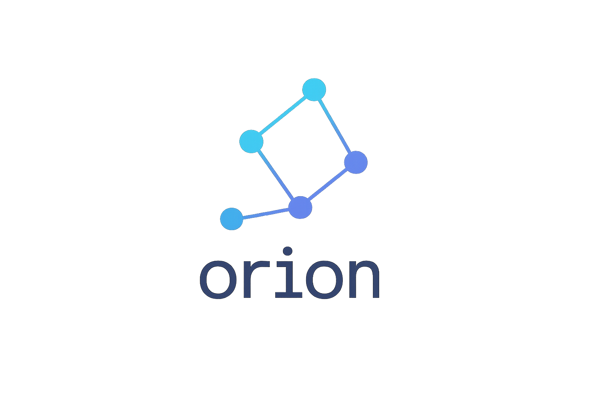

<p align="center">
  
</p>

# Orion

> Kubernetes for JS Developers — a full TypeScript control plane, agent, CLI, and dashboard for orchestrating JavaScript services without containers.

Orion brings declarative orchestration to Node.js, Next.js, Bun, Deno, and other modern JavaScript runtimes. It provides a lightweight control plane, agents, CLI, dashboard, and DNS automation so you can deploy, scale, and observe services across laptops or fleets of machines.

## Highlights

- **TypeScript control plane** powered by Fastify + WebSocket reconciliation loops.
- **Lightweight agents** that supervise processes (Node/Bun/Deno) with restarts and heartbeats.
- **Declarative CLI** for `init`, `apply`, `get`, `logs`, `exec`, and launching the dashboard.
- **Next.js dashboard** with real-time service and node insights.
- **Shared schemas** using Zod for config validation.
- **DNS manager** with DigitalOcean, Cloudflare, AWS Route53, wildcard proxy, and local providers, plus optional wildcard SSL automation.
- **Examples** for Node, Next.js, Vite, and PWA workloads.

## Monorepo layout

```
/packages
  core          # Control plane (API server, scheduler, controllers)
  agent         # Node agent daemon
  cli           # Orion CLI
  dashboard     # Next.js + Tailwind dashboard
  dns-manager   # Multi-provider DNS automation
  shared        # Shared schemas and utilities
/examples
  simple-service
  next-app
  vite-app
  vite-pwa
/docs
  architecture.md
  api.md
  plugins.md
  dns-manager/
```

Orion uses `pnpm` and Turborepo to coordinate builds.

## Quick start

1. **Install dependencies**

```bash
pnpm install
```

2. **Launch the full stack (control plane, agent, dashboard)**

```bash
scripts/dev.sh
```

3. **Deploy a configuration**

```bash
pnpm --filter @orion/cli run dev
# in another terminal
gorion init
gorion apply -f orion.yaml
```

4. **Open the dashboard**

Visit http://localhost:3000 to inspect services, nodes, and live cluster state.

5. **DOCS**

For more infos go see the  [wiki orion](https://github.com/Assoverse/Orion/wiki)

## Declarative configuration

```yaml
apiVersion: orion/v1
kind: Config
metadata:
  name: demo
  environment: dev
spec:
  services:
    - name: api-users
      path: ./examples/simple-service
      entry: src/index.ts
      runtime: node
      replicas: 2
      env:
        NODE_ENV: development
      ports:
        - name: http
          port: 4000
    - name: web
      path: ./examples/next-app
      type: nextjs
      runtime: node
      replicas: 1
  nodes: []
```

## Core packages

- **@orion/core** – REST + WebSocket API server with a round-robin scheduler and reconciliation loops.
- **@orion/agent** – Node 20+ daemon streaming metrics, heartbeats, and running processes with restart policies.
- **@orion/cli** – Commander-based CLI with Chalk/Ora UX and schema validation.
- **@orion/dashboard** – Next.js 14 + Tailwind dashboard for services, nodes, and (future) live logs.
- **@orion/dns-manager** – Multi-provider DNS + optional wildcard SSL automation.
- **@orion/shared** – Zod schemas, logger helpers, ID/time utilities shared across packages.

## Roadmap

- Streaming logs and remote exec (`orion logs --follow`, `orion exec`).
- Auto-scaling driven by CPU/memory policies.
- Plugin marketplace (e.g., `@orion/plugin-vercel`).
- Auth & RBAC with JWT roles.
- Serverless triggers (HTTP, cron, queue integrations).
- Multi-cluster federation and preview environments.

## License

Licensed under [Apache 2.0](LICENSE).
