  

# Architecture Overview

Orion follows a modular control-plane/agent model inspired by Kubernetes while focusing on JavaScript runtimes.

## High-Level Diagram

```mermaid
graph TD
  subgraph Control Plane
    API[Fastify API] --> Scheduler
    Scheduler --> Controllers[Reconciliation Controllers]
    Controllers --> StateStore[(SQLite or MongoDB)]
  end

  subgraph Agents
    Agent[Orion Agent] --> Runner[Service Runner]
    Runner --> Processes[Node/Bun/Deno Processes]
  end

  CLI[orion CLI] --> API
  Dashboard[Next.js Dashboard] --> API
  Agent -->|WebSocket| API
  API -->|Commands| Agent
  Agent -->|Heartbeats| API
```

## Control Plane

- **Fastify API server** exposes REST endpoints (`/api/apply`, `/api/services`, `/api/nodes`) and a WebSocket bridge (`/ws`).
- **Scheduler** assigns service replicas to nodes using round-robin with room for resource-aware policies.
- **Controllers** reconcile desired state (`orion.yaml`) with actual state stored in SQLite (default) or MongoDB.
- **State Store** persists configurations, assignments, and runtime metadata.

## Agent

- Lightweight Node.js daemon connecting via WebSocket.
- Receives `launch` commands to spawn services using child processes, Bun, or Deno.
- Streams heartbeats (CPU, memory, status) and future lifecycle events back to the control plane.

## CLI

- Wrapper around the REST API with commands: `init`, `apply`, `get`, `logs`, `exec`, `dashboard`.
- Validates configuration using shared Zod schemas before sending to the control plane.

## Dashboard

- Next.js 14 + Tailwind application.
- Polls REST endpoints (and, soon, WebSocket streams) for live views of services, nodes, and events.

## DNS Manager

- Multi-provider automation layer covering DigitalOcean, Cloudflare, AWS Route53, wildcard proxy, and local DNS.
- Optional automation for wildcard TLS certificates using certbot.

## Extensibility Roadmap

- Plugin hooks (`beforeStart`, `afterDeploy`, `onFailure`) to integrate monitoring, alerts, or CI pipelines.
- Autoscaling policies driven by agent metrics.
- Federation across multiple Orion clusters with a unified dashboard.
