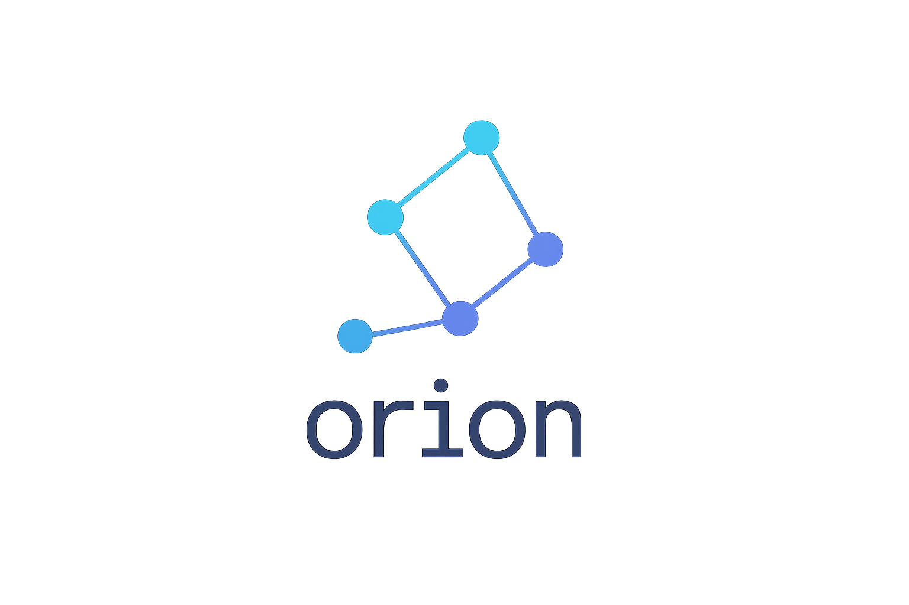

  

# Troubleshooting & FAQ

Common issues and frequently asked questions when working with Orion.

## Troubleshooting Guide

### CLI Cannot Reach Control Plane

- **Symptoms**: `ECONNREFUSED`, timeouts, or 404 from `orion apply`.
- **Fixes**:
  - Ensure the control plane is running (`scripts/dev.sh` or custom deployment).
  - Verify `ORION_API_URL` or CLI `--api-url` matches the control plane address.
  - Check reverse proxy/TLS configuration if using HTTPS.

### Agents Not Appearing in `orion get nodes`

- Confirm the agent process is running and points to the correct API URL.
- Inspect agent logs for handshake errors (invalid TLS, network ACLs).
- Make sure the control plane WebSocket port is reachable (default same as API).

### Services Stuck Pending

- Scheduler may not find available agents (no nodes or insufficient capacity).
- Validate service `path` and `entry` references; missing files cause launch failures.
- Check agent logs for crash loops; fix runtime errors in the service code.

### DNS Records Not Created

- Ensure `spec.dns` is defined and credentials are exported.
- Verify provider API tokens have correct permissions.
- Check logs from the DNS manager component (control plane output).

### Dashboard Shows Stale Data

- The current version uses polling; refresh the page to confirm status.
- Ensure the dashboard `NEXT_PUBLIC_ORION_API_URL` matches the control plane.
- Consider restarting `pnpm --filter @orion/dashboard dev` if using hot reload.

## FAQ

**Q: Does Orion replace Kubernetes?**  
A: Orion targets JavaScript-focused teams that need lighter orchestration without containers. It does not aim to replace full Kubernetes installations for polyglot workloads.

**Q: Can I run Orion in production today?**  
A: The project is pre-1.0; production readiness requires completing planned features such as RBAC, secure transport, and autoscaling. Use carefully for internal or staging environments.

**Q: How do I add custom health checks?**  
A: Near-term roadmap introduces hooks and controller support for health probes. Today you can implement health checks inside your service and expose readiness on HTTP endpoints monitored externally.

**Q: What runtimes are supported?**  
A: Node.js is first-class, with Bun and Deno supported through configurable commands. Additional runtimes (e.g., Python via wrappers) can be integrated via plugins.

**Q: Can I run multiple environments?**  
A: Yes. Maintain separate `orion.<env>.yaml` files and point agents/CLI to the respective control plane instance or namespace.

**Q: Where are logs stored?**  
A: Logs are currently streamed to the agent process and surfaced through the CLI (when streaming is enabled). Persist logs using system logging or future integrations.
